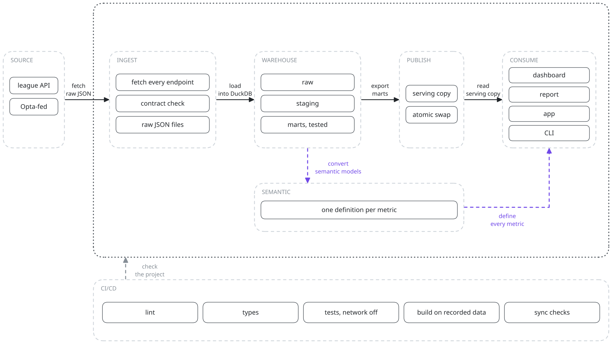
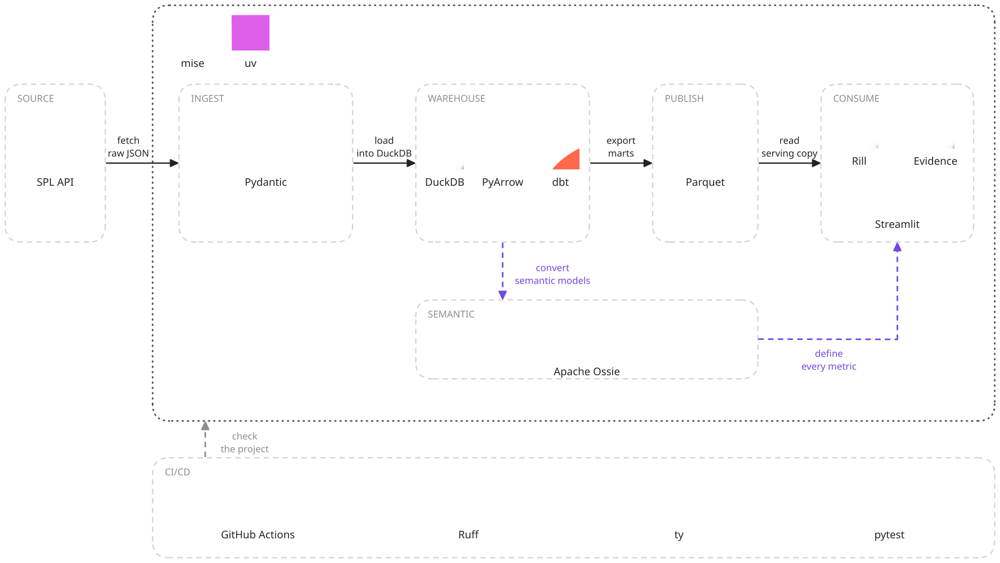

# dawri-lab

Saudi Pro League data product: facts, not predictions.

Built lesson by lesson in
`~/helm/06-learning/python-programming/python-project-building/`.



## What it answers

Deterministic only. No predictions, no "who wins the league". Marts and
dashboards answer factual questions: strongest team by evidence, best
players per position (per 90, minutes floor), value for money (needs an
external market-value source; the SPL API has none).

## How it works

1. **Source.** The Saudi Pro League's own API (`api-sdp.spl.com.sa/v1/spl/football`),
   Opta-fed, no key. 16 seasons back to 2011/12; 2025/26 and the live 2026/27 are loaded.
2. **Land.** `dawri ingest` pulls each endpoint with HTTPX and writes raw JSON to `data/`.
   Pydantic contracts check the payloads at the boundary.
3. **Warehouse.** `dawri load` loads the raw JSON into DuckDB through PyArrow.
   `dawri build` runs dbt: `raw` to `staging` to `marts`, tested on every build.
4. **Publish.** After a green build, the marts are written as Parquet to
   `data/serving/` and swapped in with one rename. Readers never hold a lock on the build.
5. **Define.** dbt's semantic models are converted to one Apache Ossie document,
   `semantic/dawri.ossie.yaml`. Each metric is defined there once.
6. **Consume.** Rill, Evidence and Streamlit read the serving copy, with metrics
   generated from or queried through Ossie, so every screen shows the same number.

## Tech stack



## Run it

Needs [uv](https://docs.astral.sh/uv/) and [mise](https://mise.jdx.dev/).

```sh
mise install && uv sync
uv run dbt deps --project-dir dbt --profiles-dir dbt

uv run dawri run 2026/2027        # ingest -> load -> build -> publish
uv run dawri metrics 2026/2027    # team metrics, through Ossie
```

Read it:

```sh
uv run streamlit run src/dawri/app.py         # app on localhost:8501
rill start rill                               # dashboard
cd evidence && npm install && npm run sources && npm run dev  # report
```

## Checks

```sh
uv run ruff check && uv run ty check && uv run pytest   # tests never touch the network
mise run semantic-check    # Ossie document matches dbt, both engines agree
mise run rill-sync -- --check
mise run evidence-sync -- --check
mise run app-check         # the app defines no metric of its own
```

CI runs all of these on every push, with dbt built on recorded fixtures.

## Layout

```
src/dawri/   CLI, ingest, load, publish, semantic, Streamlit app
dbt/         staging and marts models, tests, semantic models
semantic/    the Ossie document
rill/        dashboard project (metrics generated from Ossie)
evidence/    report project (sources generated from Ossie)
scripts/     sync and parity scripts
tasks/       one file per lesson
docs/        API model, diagrams
```

Landed data lives in `data/` (gitignored).

The diagrams are Excalidraw files with the scene embedded:
open a `.excalidraw.svg` in [excalidraw.com](https://excalidraw.com) to edit it.
