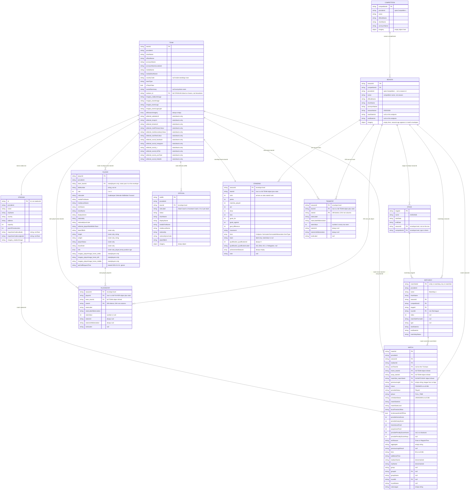

# SPL API data model

What the Saudi Pro League API actually is, and how its entities connect.
Derived by calling every season-level endpoint on 2026-09-11 and extracting
every ID field from the real responses. Not guesswork.

## What this API is

`https://api-sdp.spl.com.sa` is a **Deltatre Sport Data Platform** tenant.
SPL is not a bespoke API, it is an off-the-shelf sports platform, which is why
the paths carry a `{projectCode}` segment. Ours is `spl`.

- Base: `https://api-sdp.spl.com.sa/v1/spl/football`
- Spec: `https://api-sdp.spl.com.sa/swagger/v1/swagger.json` (**91 endpoints**, saved as `docs/spl-swagger.json`)
- Auth: none
- All calls take `?locale=en-GB`

The spec is not linked from anywhere. It exists but is undocumented publicly.

### It is not a tree

Each URL is a separate query returning a separate document. A parent never
embeds its children: `/seasons/{id}` returns 11 fields about the season and no
matches. What connects resources is **IDs, not nesting**. Same idea as foreign
keys between tables. The tree is something you reconstruct by joining.

Every ID is self-describing:

```
spl::Football_Season::0de9cda0d297418699a8357a8825d46c
     ^^^^^^^^^^^^^^^ entity type is in the value
```

So you can always tell what an ID points at without documentation.

## ERD



Reading it: nested JSON paths are flattened with `_`, so `stadium.id` becomes
`stadium_id` and `matchSet.matchSetId` becomes `matchSet_matchSetId`. Hyphenated
stat ids become underscores too (`goals-for` to `goals_for`). Fields marked
"envelope level" sit on the response root, not on the row, so you have to stamp
them onto each row at ingest. Fields marked "inlined" mean the API ships a full
copy of the child entity inside the row; the ERD lists the key and drops the
duplicated columns.

Attributes and null behavior were read off live responses on 2026-09-12, one
call per endpoint, plus all 306 rows of the landed matches file. A field noted
as always null is null in every row of that call, not just the first.


`matches` **is the fact table.** One row per match, six foreign keys, and the
measures (scores, time). Everything else is a dimension or a pre-aggregate.

## Endpoints that resolve, with grain

Season ID for 2025/26: `spl::Football_Season::0de9cda0d297418699a8357a8825d46c`


| endpoint                                     | grain      | rows              | notes                                 |
| -------------------------------------------- | ---------- | ----------------- | ------------------------------------- |
| `/seasons/{id}`                              | 1 season   | 1                 | name, competitionId, nothing else     |
| `/seasons/{id}/matches`                      | 1 match    | 306               | the fact table                        |
| `/seasons/{id}/standings`                    | 1 team     | 18                | 12 stats per team, EAV like the rest  |
| `/seasons/{id}/teams`                        | 1 team     | 18                | team dimension, includes home stadium |
| `/seasons/{id}/stadiums`                     | 1 stadium  | 18                | stadium dimension                     |
| `/seasons/{id}/matchdays`                    | 1 matchday | 34                | matchday dimension                    |
| `/seasons/{id}/stages`                       | 1 stage    | 1                 | single stage, flat league             |
| `/seasons/{id}/stats/teams`                  | 1 team     | 18                | **199 distinct stats**                |
| `/seasons/{id}/stats/players`                | 1 player   | 30/page, 23 pages | **205 distinct stats**                |
| `/seasons/{id}/transfers`                    | -          | 0                 | returns empty                         |
| `/v2/.../seasons/{id}/teams/{teamId}/roster` | 1 player   | 24-166 per team   | squad history, staff in `officials`    |
| `/competitions/{id}/seasons`                 | 1 season   | -                 | how to find other seasons             |


404 at season level: `players`, `rounds`, `statistics`, `squads`, `venues`,
`officials`. Use the paths in the table instead.

## Facts that shape the ingest

**The 2025/26 season is complete.** All 306 matches are `FINISHED`,
18 teams x 17 opponents x 2 legs. Team stats show 34 games played. Nothing in
this dataset is live or provisional, which suits a facts-only product.

**Stats come back long, not wide.** Both stats endpoints return an array per
entity, not columns:

```json
{"statsId": "goals", "statsLabel": "Goals", "statsValue": 1, "statsUnit": null}
```

That is entity-attribute-value. 205 stat types for players, 199 for teams,
and `standings` uses the same envelope for its 12 columns.
Land it as-is, pivot in DuckDB. Do not try to flatten at ingest time.

**The roster is not the season squad.** Per-team counts run 24 to 166, 1,896
rows across the 18 teams, against roughly 690 players in `stats/players`, and
ages inside one roster reach 53. The `seasonId` in the path does not scope it.
There is no flag to filter on either: in the two teams checked every row is
`playerStatus: Active` with an empty `leaveDate`, and `bibNumber` is blank on
44 of 166. Treat `stats/players` as the list of who actually played, and the
roster as biographical lookup only. Officials sit in a separate `officials`
array, 0 to 2 per team, Head Coach and sometimes an Assistant Coach.

`stats/players` **is paginated, nothing else is.** `{"totalPages": 23, "currentPage": 1, "isLastPage": false}` at 30 per page, roughly 690 players.
Every other endpoint returns the full set in one call.

**Position lives on** `roleLabel`**, and it is already on the stats rows.**
`1 Goalkeeper, 2 Defender, 3 Midfielder, 4 Forward`. Since `stats/players`
carries `role`, `roleLabel` and `team`, "best per position" needs that one
endpoint. No roster join required.

**Envelopes are inconsistent.** `/seasons/{id}` returns `{"season": {...}}`
singular while `/competitions/{id}` returns `{"competitions": ...}` plural for a
single record. `stadiums` keys its ID as `id`, everything else uses
`<entity>Id`. Endpoints that go through the competition include a `competition`
block; `/seasons/{id}` does not. `/stages` misspells its envelope key as
`competitonId`. Rows from `/stats/players` and the roster carry their own
`apiCallRequestTime` set to `0001-01-01`, a leaked base-class field, not data.
Assume nothing is uniform, check each one.

## Reading the spec

```bash
# all endpoints
jq -r '.paths | keys[]' docs/spl-swagger.json

# schema names
jq -r '.components.schemas | keys[]' docs/spl-swagger.json

# one endpoint's shape
jq '.paths["/v1/{projectCode}/football/seasons/{seasonId}/standings"]' docs/spl-swagger.json
```


## Finding IDs in any response

```bash
curl -s "$URL" | jq -r '
  [paths(type=="string") as $p
   | select(getpath($p)|test("^spl::"))
   | {k: ($p|map(select(type=="string"))|join(".")),
      t: (getpath($p)|split("::")[1])}]
  | group_by(.k) | map({key:.[0].k, type:.[0].t}) | .[]
  | "\(.key) -> \(.type)"' | sort -u
```

This is how the ERD above was built. Run it against any new endpoint and it
prints that endpoint's foreign keys.